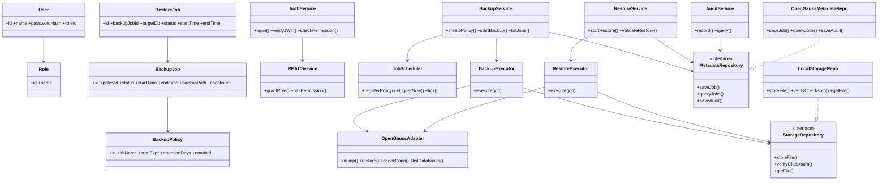

# 基于 openGauss 的数据库备份与恢复系统架构设计

## 1. 课题定义与目标

**课题名称**：Database Backup and Recovery Management System (openGauss-based)

**目标**：构建一个面向教学场景的数据库应用系统，完成备份、恢复、任务管理、权限管理与审计查询。

**角色定义**：
- **系统管理员（System Admin）**：用户与角色管理、全局策略配置
- **数据库管理员（DBA）**：备份与恢复任务管理、数据源管理
- **审计员（Auditor/Operator）**：备份/恢复记录查询、审计追踪（只读）

---

## 2. 总体架构（简化自现有工程）

系统采用“五层架构”：

1. **接入层（Presentation/API）**
   - Web UI
   - REST API

2. **控制层（Control Service）**
   - `AuthService`（认证）
   - `RBACService`（授权）
   - `BackupService`（备份策略与任务）
   - `RestoreService`（恢复流程）
   - `JobScheduler`（任务调度）
   - `AuditService`（审计日志）

3. **执行层（Execution Engine）**
   - `BackupExecutor`
   - `RestoreExecutor`

4. **适配层（openGauss Adapter）**
   - `OpenGaussAdapter` 封装 `gs_dump`、`gs_restore`、`gsql`

5. **数据层（Persistence）**
   - openGauss 元数据库（用户、策略、任务、日志）
   - 备份文件仓库（本地目录/NFS）

---

## 3. 模块与功能职责

### 3.1 接入层
- 登录、菜单导航、任务查询、任务下发
- 对外提供统一 REST 接口（JSON）

### 3.2 控制层
- **AuthService**：账号登录、Token签发与校验
- **RBACService**：角色权限检查（管理员/DBA/审计员）
- **BackupService**：策略CRUD、备份任务创建/查询/取消
- **RestoreService**：恢复任务创建、恢复前校验、执行状态跟踪
- **JobScheduler**：定时触发任务、重试策略与并发控制
- **AuditService**：记录关键动作（谁在何时做了什么）

### 3.3 执行层
- **BackupExecutor**：
  - 读取任务参数
  - 调用 `OpenGaussAdapter.dump()`
  - 落盘备份文件、写校验和、更新状态
- **RestoreExecutor**：
  - 校验备份可用性
  - 调用 `OpenGaussAdapter.restore()`
  - 更新恢复结果与审计记录

### 3.4 适配层
- 统一封装命令行工具调用、错误码映射、输出解析
- 对上层隐藏 openGauss 工具细节

### 3.5 数据层
- 管理元数据与业务数据
- 支持组合查询（库名/时间区间/状态/操作者）

---

## 4. 技术链（Tech Stack）

- **语言与构建**：C++17、CMake
- **HTTP服务**：cpp-httplib（或 Drogon）
- **JSON**：nlohmann/json
- **数据库访问**：libpqxx（连接 openGauss/PostgreSQL 协议）
- **认证授权**：JWT + RBAC
- **调度**：croncpp（或自定义轮询）+ 线程池
- **日志**：spdlog
- **数据库工具**：gs_dump、gs_restore、gsql
- **运行环境**：Linux

---

## 5. 业务逻辑（核心流程）

### 5.1 备份流程
1. DBA 创建备份策略（库名、周期、保留天数、存储路径）
2. 调度器按策略触发备份任务（或手动触发）
3. `BackupExecutor` 调用 `gs_dump`
4. 生成备份文件并计算校验和
5. 任务状态写入元数据库，审计日志落库

### 5.2 恢复流程
1. DBA 选择备份点与目标库
2. 执行恢复前校验（权限、文件完整性、目标库状态）
3. `RestoreExecutor` 调用 `gs_restore`
4. 更新恢复任务结果并记录审计日志

### 5.3 查询流程
1. 用户发起任务/日志查询
2. API 层构造组合条件（支持模糊）
3. 返回分页结果与统计信息

---

## 6. CRUD 功能映射（满足课程功能项）

### 6.1 用户与权限管理（管理员）
- **增**：新增用户、分配角色
- **删**：删除用户/停用账号
- **改**：修改密码、角色调整
- **查**：用户列表、权限明细

### 6.2 备份策略管理（管理员/DBA）
- **增**：新增备份策略
- **删**：删除/禁用策略
- **改**：修改周期、保留期、目标路径
- **查**：策略列表与生效状态

### 6.3 备份任务管理（DBA）
- **增**：手动创建备份任务
- **删**：清理历史任务记录
- **改**：取消/重试任务（状态变更）
- **查**：按库名、时间、状态查询任务

### 6.4 恢复任务管理（DBA）
- **增**：创建恢复任务
- **删**：清理恢复历史
- **改**：执行前修改恢复参数
- **查**：恢复结果与错误原因

### 6.5 审计日志（管理员/审计员）
- **增**：系统自动追加审计记录
- **删**：按保留策略清理历史
- **改**：仅允许变更归档标记，不改正文
- **查**：按操作者/操作类型/时间段查询

---

## 7. C++ 核心类图（Mermaid）

---

## 8. 与评分标准的对齐说明（40分开发手册）

### 8.1 项目规划（10分）
- 目标清晰：备份/恢复/权限/审计
- 角色边界清晰：管理员/DBA/审计员
- 架构分层清晰：接入、控制、执行、适配、数据

### 8.2 数据库设计（20分）
- 元数据实体完备：用户、角色、策略、任务、日志
- 可支持主外键、索引、组合查询
- 可输出ER图、建表SQL、索引SQL与关键查询SQL

### 8.3 系统开发与实现（10分）
- 有完整技术链与类图
- 有端到端业务流程（备份、恢复、查询）
- 可演示核心功能并留存日志

---

## 9. 课程落地建议（MVP）

- 优先实现：登录/RBAC、策略CRUD、备份任务、恢复任务、查询与审计
- 先做逻辑备份恢复（`gs_dump`/`gs_restore`），减少复杂度
- 保证每个评分项有可展示页面与可验证数据

---

## 10. 一句话总结

该架构以 openGauss 为核心，通过“控制层 + 执行层 + 适配层 + 元数据层”的最小可用设计，在课程范围内完整覆盖数据库应用系统开发手册所需的规划、设计与实现要求。